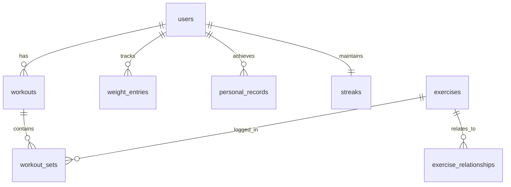

# Database Schema

Mo uses **PostgreSQL** via **Neon** (serverless) with **Drizzle ORM**.

For the full schema, see `lib/db/schema.ts` in the [mo-app repository](https://github.com/tumativerse/mo-app).

---

## Overview



---

## Tables by Domain

### MO:SELF (Foundation)

| Table | Purpose |
|-------|---------|
| `users` | User profiles and preferences |
| `streaks` | Workout consistency tracking |
| `personal_records` | Exercise PRs with estimated 1RM |
| `user_preferences` | Training settings, equipment level |
| `user_exercise_defaults` | Last used weights per exercise |

### MO:PULSE (Tracking)

| Table | Purpose |
|-------|---------|
| `workout_sessions` | Active/completed workouts |
| `session_exercises` | Exercises in a session |
| `session_sets` | Logged sets (weight, reps, RPE) |
| `weight_entries` | Body weight tracking |
| `recovery_logs` | Sleep, energy, soreness |
| `warmup_logs` | Warmup completion tracking |

### MO:COACH (Intelligence)

| Table | Purpose |
|-------|---------|
| `fatigue_logs` | Daily fatigue scores with component breakdown |
| `deload_periods` | Deload week tracking |

### MO:CONNECT (Library)

| Table | Purpose |
|-------|---------|
| `exercises` | Exercise library (~750 exercises) |
| `exercise_relationships` | Variations, alternatives, progressions |
| `program_templates` | PPL template structure |
| `template_days` | Days within a program |
| `template_slots` | Movement pattern slots |
| `warmup_templates` | Warmup protocols by day type |
| `warmup_phases` | Warmup phase definitions |
| `warmup_phase_exercises` | Exercises in each warmup phase |

---

## Key Concepts

### Movement Patterns

Exercises are categorized by pattern for smart substitutions:

| Pattern | Examples |
|---------|----------|
| `horizontal_push` | Bench press, push-up |
| `vertical_push` | Overhead press |
| `horizontal_pull` | Rows, face pulls |
| `vertical_pull` | Pull-ups, lat pulldown |
| `squat` | Back squat, goblet squat |
| `hinge` | Deadlift, RDL |
| `lunge` | Walking lunge, split squat |
| `core` | Plank, dead bug |

### Exercise Relationships

| Type | Description | Example |
|------|-------------|---------|
| `variation` | Same movement, different setup | Incline vs Flat Bench |
| `alternative` | Different exercise, same muscles | Bench Press vs Push-Up |
| `progression` | Harder version | Push-Up → Weighted Push-Up |
| `regression` | Easier version | Push-Up → Knee Push-Up |

### Session Status

| Status | Description |
|--------|-------------|
| `planned` | Session created but not started |
| `warmup` | Warmup in progress |
| `in_progress` | Main workout active |
| `completed` | Session finished |
| `skipped` | Session was skipped |

### Equipment Levels

| Level | Description |
|-------|-------------|
| `full_gym` | Commercial gym with all equipment |
| `home_gym` | Barbell, dumbbells, bench, rack |
| `bodyweight` | No equipment needed |

---

## Enums

```typescript
// Exercise categorization
exerciseUse: 'training' | 'warmup' | 'both'
slotType: 'primary' | 'secondary' | 'accessory' | 'optional'
dayType: 'push' | 'pull' | 'legs' | 'upper' | 'lower' | 'full_body'

// Warmup phases
warmupPhaseType: 'general' | 'dynamic' | 'movement_prep'

// User settings
equipmentLevel: 'full_gym' | 'home_gym' | 'bodyweight'

// Session tracking
sessionStatus: 'planned' | 'warmup' | 'in_progress' | 'completed' | 'skipped'

// Training intelligence
deloadType: 'volume' | 'intensity' | 'full_rest'
fatigueLevel: 'fresh' | 'normal' | 'elevated' | 'high' | 'critical'
```

---

## Learn More

- [Full Schema](https://github.com/tumativerse/mo-app/blob/main/lib/db/schema.ts) - Complete Drizzle schema (~1190 lines)
